  

 

  
  
  

---

## Uzair Waseem

I am a Dublin-based software, AI, cloud, automation and cybersecurity engineer building production-ready web products, data workflows, QA systems and secure delivery pipelines.

I am currently focused on roles across Ireland, hybrid and remote markets:

- Software Engineer / Full-stack Engineer
- AI / Data Engineer
- Cloud / DevOps Engineer
- Cybersecurity Engineer
- QA Automation Engineer

## Selected Work

These repositories are honest portfolio prototypes: small, runnable, documented projects that show how I approach product engineering, automation, security, delivery visibility and AI workflows.

| Project | What it shows | Stack |
| --- | --- | --- |
| [SentryScan Threat Monitoring](https://github.com/Assembler-Fourier/sentryscan-threat-monitoring) | Risk-ranked security event triage with anomaly scoring and a FastAPI surface. | Python, FastAPI, security events, SIEM-style triage |
| [TaskForge Workflow App](https://github.com/Assembler-Fourier/taskforge-workflow-app) | API-first workflow board with task states, sprint summary logic and a rendered product view. | JavaScript, Node.js, REST-style APIs, workflow modeling |
| [SecureFlow Delivery Dashboard](https://github.com/Assembler-Fourier/secureflow-delivery-dashboard) | Delivery analytics for sprint health, blocker pressure, QA confidence and release readiness. | JavaScript, Node.js, dashboards, CI/CD signals |
| [DocuMind RAG Assistant](https://github.com/Assembler-Fourier/documind-rag-assistant) | Retrieval-augmented document Q&A with transparent scoring and citations. | Python, RAG architecture, document retrieval |
| [Portfolio Website](https://github.com/Assembler-Fourier/uzair-waseem-portfolio) | Recruiter-focused Next.js landing page deployed on Vercel at uzairwaseem.com. | Next.js, React, TypeScript, SEO, Vercel |

## Stack Snapshot

**Product and frontend:** React, Next.js, TypeScript, JavaScript, responsive UI, accessibility, SEO  
**Backend and data:** Node.js, Python, FastAPI, REST APIs, SQL, PostgreSQL, MongoDB, dashboards  
**Cloud and delivery:** AWS, Azure, Docker, Kubernetes, Terraform, GitHub Actions, CI/CD, Vercel  
**Quality and security:** Playwright, Selenium, Cypress, API testing, QA automation, OWASP, secure SDLC, threat modeling  
**AI and analytics:** PyTorch, scikit-learn, Hugging Face, LangChain, RAG, vector search, ETL, Power BI

## Current Direction

- MSc Cybersecurity at National College of Ireland, Dublin
- BSc Computer Science from FAST NUCES
- Building a public project set around software engineering, AI/data workflows, cloud automation, QA and secure delivery
- Open to software, AI/data, cloud/DevOps, cybersecurity, QA automation, technical product and support roles

## Contact

Portfolio: [uzairwaseem.com](https://uzairwaseem.com)  
LinkedIn: [linkedin.com/in/uzair-waseem](https://www.linkedin.com/in/uzair-waseem/)  
Email: [uzairwaseem29@gmail.com](mailto:uzairwaseem29@gmail.com)  
Location: Dublin, Ireland

